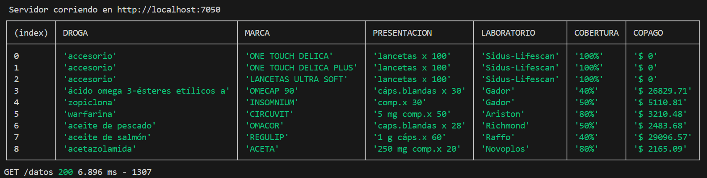
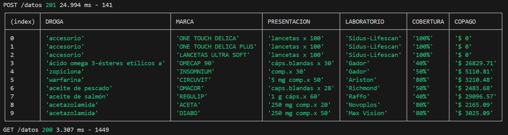
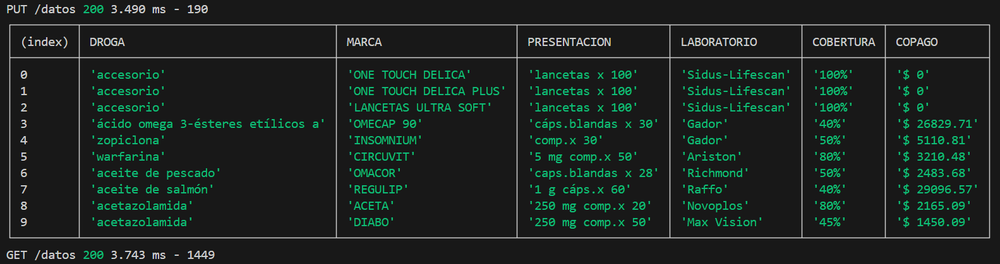
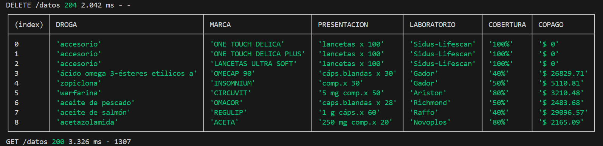

# Trabajo Practico - Grupal
## 📁 Descripción del Trabajo

Este proyecto es una aplicación backend desarrollada en **Node.js** utilizando el framework **Express**. El objetivo fue construir una API REST que gestione un conjunto de medicamentos y permita realizar operaciones como consulta, alta, modificación y eliminación de datos.

La aplicación se ejecuta en el puerto **7050** y expone múltiples endpoints para manipular los datos cargados desde un archivo JSON.

---

## 📊 Fuente de Datos

La fuente de datos elegida fue un archivo en formato `JSON` que simula la cobertura de medicamentos, sus marcas, laboratorios y valores de copago. Se eligió este formato por su facilidad de lectura y escritura en Node.js, y por su estructura clara para trabajar con objetos y arrays.

El archivo incluye campos como:

- `DROGA`
- `MARCA`
- `PRESENTACION`
- `LABORATORIO`
- `COBERTURA`
- `COPAGO`

### 📂 Origen

Los datos fueron generados manualmente simulando una lista de medicamentos real, basándonos en estructuras similares a la que se encuentra en servicio de la cobertura de obra social PAMI. Fecha de vigencia : 01/04/2025.

---

## 🧪 Datos utilizados para pruebas

```json
[
  {"DROGA":"accesorio","MARCA":"ONE TOUCH DELICA","PRESENTACION":"lancetas x 100","LABORATORIO":"Sidus-Lifescan","COBERTURA":"100%","COPAGO":"$ 0"},
  {"DROGA":"accesorio","MARCA":"ONE TOUCH DELICA PLUS","PRESENTACION":"lancetas x 100","LABORATORIO":"Sidus-Lifescan","COBERTURA":"100%","COPAGO":"$ 0"},
  {"DROGA":"accesorio","MARCA":"LANCETAS ULTRA SOFT","PRESENTACION":"lancetas x 100","LABORATORIO":"Sidus-Lifescan","COBERTURA":"100%","COPAGO":"$ 0"},
  {"DROGA":"ácido omega 3-ésteres etílicos a","MARCA":"OMECAP 90","PRESENTACION":"cáps.blandas x 30","LABORATORIO":"Gador","COBERTURA":"40%","COPAGO":"$ 26829.71"},
  {"DROGA":"zopiclona","MARCA":"INSOMNIUM","PRESENTACION":"comp.x 30","LABORATORIO":"Gador","COBERTURA":"50%","COPAGO":"$ 5110.81"},
  {"DROGA":"warfarina","MARCA":"CIRCUVIT","PRESENTACION":"5 mg comp.x 50","LABORATORIO":"Ariston","COBERTURA":"80%","COPAGO":"$ 3210.48"},
  {"DROGA":"aceite de pescado","MARCA":"OMACOR","PRESENTACION":"caps.blandas x 28","LABORATORIO":"Richmond","COBERTURA":"50%","COPAGO":"$ 2483.68"},
  {"DROGA":"aceite de salmón","MARCA":"REGULIP","PRESENTACION":"1 g cáps.x 60","LABORATORIO":"Raffo","COBERTURA":"40%","COPAGO":"$ 29096.57"},
  {"DROGA":"acetazolamida","MARCA":"ACETA","PRESENTACION":"250 mg comp.x 20","LABORATORIO":"Novoplos","COBERTURA":"80%","COPAGO":"$ 2165.09"}
]
```
---
## 🚀 Endpoints Implementados

### ✅ GET `/datos`
**Descripción:** Devuelve la lista completa de medicamentos.  
**Respuesta:** `200 OK` con array de objetos JSON.


---

### ✅ POST `/datos`
**Descripción:** Permite agregar un nuevo medicamento.  
**Cuerpo esperado (JSON):**
```json
{
  "DROGA": "acetazolamida",
  "MARCA": "DIABO",
  "PRESENTACION": "250 mg comp.x 50",
  "LABORATORIO": "Max Vision",
  "COBERTURA": "80%",
  "COPAGO": "$ 3025.09"
}
```

### ✅ PUT `/datos`
**Descripción:** Modifica un medicamento existente (por MARCA y LABORATORIO).
**Cuerpo esperado (JSON):**

``` json
{
  "MARCA": "DIABO",
  "LABORATORIO": "Max Vision",
  "COBERTURA": "45%",
  "COPAGO": "$ 1450.09"
}
```


### ✅ DELETE `/datos/marca/:marca`
**Descripción:** Elimina todos los medicamentos con una MARCA específica.  
**Nota:** Para marcas con espacios, usá guiones (-) en su lugar. **Ejemplo:** /datos/marca/mi-marca-generica 


### ✅ DELETE `/datos/droga/:droga`
**Descripción:** Elimina un medicamento por su DROGA.

### ✅ GET `/datos/laboratorio/:lab`
**Descripción:** Filtra medicamentos por laboratorio.

### ✅ GET `/datos/droga/:droga`
**Descripción:** Filtra medicamentos por droga.

### ✅ GET `/datos/cobertura/baja`
**Descripción:** Retorna medicamentos cuya cobertura es menor al 50%.

### ✅ DELETE `/datos/laboratorio/:lab`
**Descripción:** Elimina todos los medicamentos asociados a un laboratorio dado.

## 🧪 Pruebas con curl (Terminal)
### ▶️ Obtener todos los medicamentos
``` json
curl http://localhost:7050/datos
```
### ➕ Agregar medicamento
``` json
curl -X POST -H "Content-Type: application/json" \
  -d '{"DROGA": "acetazolamida","MARCA": "DIABO","PRESENTACION": "250 mg comp.x 50","LABORATORIO": "Max Vision","COBERTURA": "80%","COPAGO": "$ 3025.09"}' \
  http://localhost:7050/datos
```
### ✏️ Modificar medicamento
``` json
curl -X PUT -H "Content-Type: application/json" \
  -d '{"MARCA":"DIABO","LABORATORIO":"Max Vision","COBERTURA":"45%","COPAGO":"$ 1450.09"}' \
  http://localhost:7050/datos
```
### ❌ Eliminar medicamento por MARCA
``` json
curl -X DELETE -H "Content-Type: application/json" \
  -d '{"MARCA":"DIABO"}' \
  http://localhost:7050/datos
```
### 🔍 Buscar por laboratorio
``` json
curl http://localhost:7050/datos/laboratorio/Sidus-Lifescan
```
### 🔍 Buscar por droga
``` json
curl http://localhost:7050/datos/droga/acetazolamida
```
### 🔽 Medicamentos con cobertura baja (< 50%)
``` json
curl http://localhost:7050/datos/cobertura/baja
```
### 🔥 Eliminar todos los medicamentos de un laboratorio
``` json
curl -X DELETE http://localhost:7050/datos/laboratorio/Gador
```
### 👨‍💻 Autores
Integrantes del grupo:
- `Ruth Leila Gomez`
- `Marcos Felipe Zardain`
